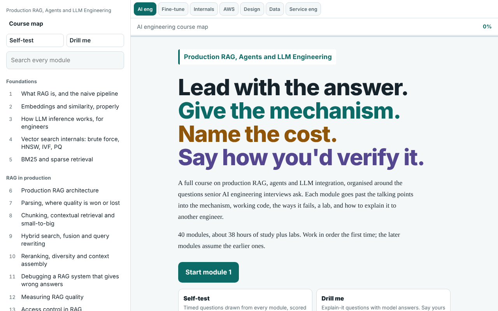

# engineering-courses-hub

Seven self-study courses for engineers moving into AI engineering, packaged as one offline web app: 270 modules, about 260 hours of study, and about 800 self-test questions.

**[Open the live site](https://pawla-homsi.github.io/engineering-courses-hub/)**



## Why I built it

I am a backend engineer with about seven years in production systems, retraining toward AI and data engineering. Most material I found was either beginner tutorials or research papers. I wanted something in between: courses that start from how a production engineer thinks (failure modes, cost, latency, evaluation, operability) and that I could drill myself on before interviews.

## Courses

| Course | Modules | Hours | Covers |
|---|---:|---:|---|
| Production RAG, Agents and LLM Engineering | 40 | 38 | Retrieval, hybrid search, reranking, RAG evaluation, agents, LLM production engineering |
| LLM System Design | 40 | 40 | A design method, building blocks, scale and cost, safety, worked designs |
| Model Internals | 40 | 38 | Transformers, training, post-training, inference, interpretability |
| Fine-tuning and Model Adaptation | 40 | 37 | When to fine-tune, LoRA-family methods, preference tuning, distillation, evaluation |
| Data Engineering for AI | 40 | 42 | Ingestion and parsing, pipelines and indexing, governance, data for evals and training |
| Software Engineering for AI Services | 30 | 29 | Building the service, testing non-deterministic systems, operability |
| AWS Solutions Architect | 40 | 38 | Security, networking, compute, storage, resilience, cost, migration |

Full module list: [SYLLABUS.md](SYLLABUS.md).

## How each module works

Every module follows the same shape: a **deep dive** into the concept, **build it** (working code), **what breaks** (failure modes and how to spot them), a **drill**, a **teach it** prompt, and a short **self-test**. Across courses there is a timed self-test drawn from every module and a "drill me" mode with model answers.

## Use it

- **Online:** the GitHub Pages link above.
- **Offline:** download `index.html` and open it in a browser. No build step and no backend.
- **Locally served:** `python3 -m http.server 8000`, then open `http://localhost:8000`.

Progress is saved in your browser's local storage only.

## How this was made

I designed the curriculum and the module format, and wrote the courses together with Claude (Anthropic's AI assistant), which drafted most of the module text and code.

Treat it as study material, not as an authoritative reference. If you find an error, please [open an issue](https://github.com/pawla-homsi/engineering-courses-hub/issues).

## Repository layout

```
engineering-courses-hub/
├── index.html        # the whole app: content, styles and script in one file
├── SYLLABUS.md       # every module, by course and track
├── LICENSE           # MIT, for the code
├── LICENSE-CONTENT   # CC BY 4.0, for the course text
└── docs/
    └── screenshot.png
```

## Roadmap

- [ ] Split course content out of `index.html` into one Markdown file per module, with a small build script, so changes are reviewable in pull requests
- [ ] Link-check and HTML validation in CI
- [ ] Mark each module as reviewed or unreviewed

## License

Code: [MIT](LICENSE). Course text: [CC BY 4.0](LICENSE-CONTENT).
